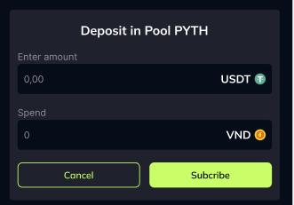

-   Picture above shows the payment action on-ramp.
-   User click subcribe button on the demo page.
-   User is redirected to the payment flow.
-   Call "A" is the people who code this project frontend and backend.
-   Call "B" is the people who code the payment gateway.
-   A-Frontend: User bấm “Subscribe”.
    A-Backend: POST /api/orders
    Validate input; ghi bản ghi order (status=pending) + idempotency_key.
    Gọi B.CreateOrder với:
    amount_usdt, fiat="VND", chain="SOLANA", token="USDT"
    beneficiary_wallet = publicKey ví user (để nhận LP)
    pool_id, slippage_bps/min_out, metadata (client_order_id, user_id)
    success_url, cancel_url
    Lưu payment_id, payment_token, links trả về.
    A-Frontend: nhận response → lấy links
    Chọn link rel="pay" hoặc rel="order" → window.location.href tới trang của B.
    User hoàn tất thanh toán VND (KYC/3DS…).
    Khi trạng thái fiat = PAID, B chuyển sang bước on-chain settlement NGAY LÚC NÀY.

Webhook và Redirect về success_url (B → A)
Webhook (trước hoặc ngay khi redirect, tùy SLA)
B gọi webhook tới A: event=payment.succeeded, payment_id, status=SETTLED, amount_vnd, amount_usdt_delivered, tx_signature, chain=SOLANA, token=USDT, beneficiary_wallet, pool_id, metadata, version, occurred_at.
A xác minh chữ ký, cập nhật DB: status=SETTLED, lưu tx_signature.
Redirect:
B redirect user về success_url, gắn query:
orderId, payment_id, tx=tx_signature, status=settled
Nếu B redirect ngay khi mới broadcast:
status=processing, tx=tx_signature (optional). A sẽ poll/cập nhật khi finalized/webhook đến.

A-Frontend: đọc query (?orderId, payment_id, tx).
A-Frontend: gọi A-Backend POST /api/orders/{orderId}/capture?payment_id=...
A-Backend: gọi B.GetOrder (hoặc đọc DB nếu webhook đã cập nhật) → trả status + tx_signature.
A-Frontend: hiển thị kết quả:
Nếu status=settled và có tx_signature:
Cho phép user “View on Explorer”.
Hiển thị nút “Done” (vì LP đã mint vào ví user).
Nếu status=processing:
Hiển thị spinner + auto-poll 3–5s/lần tới khi settled hoặc timeout → hướng dẫn liên hệ hỗ trợ.

-   This is ez demo project, do not use in production. So it not nessary to use DB at backend.
